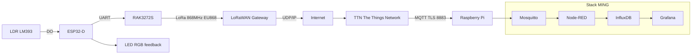
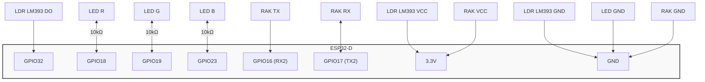
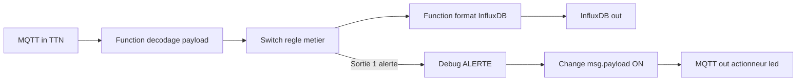
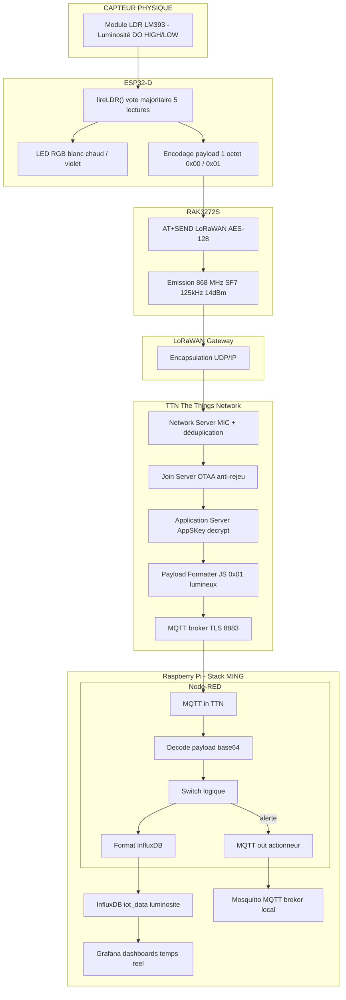

# Projet IoT - Étapes pas à pas

## TABLE DES MATIÈRES

1. [Vue d'ensemble du projet](#1-vue-densemble-du-projet)
2. [Matériel utilisé](#2-matériel-utilisé)
3. [Câblage complet](#3-câblage-complet)
4. [Le module LDR LM393](#4-le-module-ldr-lm393)
5. [La LED RGB](#5-la-led-rgb)
6. [Configuration TTN Console](#6-configuration-ttn-console)
7. [Le code ESP32-D expliqué ligne par ligne](#7-le-code-esp32-d-expliqué-ligne-par-ligne)
8. [LoRaWAN et RAK3272S](#8-lorawan-et-rak3272s)
9. [Payload et encodage](#9-payload-et-encodage)
10. [Payload Formatter TTN (décodeur JavaScript)](#10-payload-formatter-ttn-décodeur-javascript)
11. [La stack MING — Vue d'ensemble](#11-la-stack-ming--vue-densemble)
12. [Mosquitto — Le broker MQTT](#12-mosquitto--le-broker-mqtt)
13. [Node-RED — Le moteur de flux](#13-node-red--le-moteur-de-flux)
14. [InfluxDB — La base de données temporelles](#14-influxdb--la-base-de-données-temporelles)
15. [Grafana — La visualisation](#15-grafana--la-visualisation)
16. [Hardening de la stack MING (Sécurité)](#16-hardening-de-la-stack-ming-sécurité)
17. [Flux de données complet de bout en bout](#17-flux-de-données-complet-de-bout-en-bout)
18. [Calibration et diagnostic](#18-calibration-et-diagnostic)
19. [Dépannage rapide](#19-dépannage-rapide)
20. [Lexique complet](#20-lexique-complet)

---

## 1. Vue d'ensemble du projet

Ce projet implémente un système IoT complet de surveillance de luminosité. Voici ce que fait le système de bout en bout :

1. Un **module LDR LM393** détecte si l'environnement est sombre ou lumineux.
2. Une **LED RGB** donne un retour visuel immédiat sur l'ESP32 (violet = sombre, blanc chaud = lumineux).
3. L'**ESP32-D** lit l'état du capteur et encode la donnée en 1 octet hexadécimal.
4. Le **RAK3272S** transmet la trame via **LoRaWAN** sur la bande 868 MHz (EU868).
5. Une **gateway LoRaWAN** reçoit la trame radio et la transmet en UDP/IP vers internet.
6. **TTN (The Things Network)** reçoit la trame, déchiffre la couche réseau, décode le payload et le publie via **MQTT**.
7. **Node-RED** (sur Raspberry Pi) reçoit le message MQTT de TTN, décode le payload base64, applique des règles métier.
8. **InfluxDB** stocke les données avec leur timestamp.
9. **Grafana** visualise les données sous forme de graphiques, jauges et statistiques.



---

## 2. Matériel utilisé

| Composant | Quantité | Rôle |
|-----------|----------|------|
| ESP32-D HW-394 | 1 | Microcontrôleur principal |
| Module LDR LM393 (3 broches) | 1 | Capteur de luminosité numérique |
| Module RAK3272S Breakout | 1 | Modem LoRa (radio 868 MHz) |
| LED RGB cathode commune | 1 | Feedback visuel état luminosité |
| Résistances 10kΩ | 3 | Limitation courant LED RGB |
| Antenne LoRa 868 MHz (RP-SMA) | 1 | Émission radio (OBLIGATOIRE avant mise sous tension) |
| Fils Dupont M-M et M-F | ≥10 | Connexions breadboard |
| Breadboard | 1 | Montage sans soudure |
| Câble USB-C | 1 | Alimentation + programmation ESP32 |
| Raspberry Pi 3/4 | 1 | Hébergement stack MING |
| Carte microSD 16Go+ | 1 | OS Raspberry Pi |
| Câble Ethernet | 1 | Connexion RPi au réseau local |

---

## 3. Câblage complet

### 3.1 LDR LM393 → ESP32-D

| Module LDR LM393 | ESP32-D HW-394 |
|------------------|----------------|
| VCC              | 3.3V           |
| GND              | GND            |
| DO               | GPIO32         |

> **Pourquoi GPIO32 ?**
> GPIO32 appartient à l'ADC1. Les broches ADC2 (GPIO0, 2, 4, 12–15, 25–27) sont instables quand le module radio est actif. Même si on utilise ici `digitalRead` (pas analogique), GPIO32 est le choix le plus stable.

> **Jamais 5V** sur le module LM393 — alimentation 3.3V uniquement.

### 3.2 LED RGB (cathode commune) → ESP32-D

| Signal | ESP32-D HW-394 | Résistance | LED RGB |
|--------|----------------|------------|---------|
| Rouge  | GPIO18         | 10kΩ       | R       |
| Vert   | GPIO19         | 10kΩ       | G       |
| Bleu   | GPIO23         | 10kΩ       | B       |
| Masse  | GND            | —          | Cathode commune (-) |

> **Pourquoi des résistances 10kΩ ?**
> Les GPIO ESP32 supportent maximum 40 mA. Sans résistance, le courant serait trop élevé et brûlerait la LED et/ou la broche GPIO. La résistance limite le courant à un niveau sûr (~0,33 mA ici, suffisant pour la visibilité en intérieur).

### 3.3 RAK3272S → ESP32-D

| Signal | ESP32-D HW-394 | RAK3272S Breakout | Remarque |
|--------|----------------|-------------------|----------|
| RX2    | GPIO16         | TX                | Croisement UART |
| TX2    | GPIO17         | RX                | Croisement UART |
| Alim   | 3.3V           | VCC               | Ne jamais utiliser 5V |
| Masse  | GND            | GND               | Référence commune |
| RF     | —              | Antenne 868 MHz   | À connecter avant mise sous tension |

> **Croisement TX/RX obligatoire** : le TX d'un appareil se connecte au RX de l'autre. Une erreur ici = aucune réponse AT, communication impossible.

> **Antenne impérative** : sans antenne vissée avant la mise sous tension, l'amplificateur de puissance du RAK3272S est détruit définitivement au premier envoi radio.

### 3.4 Schéma récapitulatif des connexions



---

## 4. Le module LDR LM393

### Principe de fonctionnement

Contrairement à une photorésistance simple (LDR analogique) qui varie en résistance, le module LM393 intègre un **comparateur interne** qui compare la résistance de la LDR à un seuil réglable via le potentiomètre. Sa sortie est **exclusivement numérique** :

- **DO = HIGH (1)** → lumière détectée (au-dessus du seuil)
- **DO = LOW (0)** → obscurité détectée (en dessous du seuil)

Il n'y a **pas** de sortie analogique utilisable ici — le pont diviseur est intégré dans le module.

### La micro LED du module

Le module possède une petite LED indicatrice qui s'allume au franchissement du seuil. C'est un outil de calibration visuel très pratique : pas besoin d'ouvrir le moniteur série pour voir si la détection fonctionne.

### Réglage du seuil (potentiomètre)

La vis sur le module règle la sensibilité :
- Tourner dans un sens → seuil plus haut → moins sensible (besoin de plus de lumière pour déclencher)
- Tourner dans l'autre sens → seuil plus bas → plus sensible (déclenche avec peu de lumière)

### Vote majoritaire anti-rebond

À la frontière du seuil, la broche DO peut osciller rapidement entre HIGH et LOW (phénomène de rebond). Le code résout ce problème avec **5 lectures espacées de 10 ms** :

```cpp
int lireLDR() {
    int somme = 0;
    for (int i = 0; i < NB_LECTURES_DO; i++) {  // 5 lectures
        somme += digitalRead(LDR_PIN);            // 0 ou 1
        delay(10);                                // 10ms entre lectures
    }
    // Retourne 1 si majorité HIGH (≥ 3 sur 5)
    return (somme >= (NB_LECTURES_DO / 2 + 1)) ? 1 : 0;
}
```

Si on obtient 3, 4 ou 5 lectures HIGH → état = LUMINEUX (1). Sinon → SOMBRE (0).

---

## 5. La LED RGB

### Principe

La LED RGB contient 3 LEDs indépendantes dans un seul boîtier. En faisant varier l'intensité de chaque canal (rouge, vert, bleu) via le PWM, on obtient n'importe quelle couleur. **Cathode commune** = la masse (patte la plus longue) est partagée et connectée au GND.

### LEDC PWM de l'ESP32

L'ESP32 utilise le périphérique **LEDC** (LED Control) pour générer du PWM sur ses GPIO :
- Fréquence : 5000 Hz
- Résolution : 8 bits → valeurs de **0 à 255**
- 3 canaux indépendants (un par couleur)

```cpp
ledcAttach(LED_R, 5000, 8);  // GPIO18, 5000Hz, 8 bits
ledcAttach(LED_G, 5000, 8);  // GPIO19
ledcAttach(LED_B, 5000, 8);  // GPIO23

void setLED(uint8_t r, uint8_t g, uint8_t b) {
    ledcWrite(LED_R, r);
    ledcWrite(LED_G, g);
    ledcWrite(LED_B, b);
}
```

### Couleurs utilisées dans le projet

| État luminosité | Couleur LED | Valeurs RGB | Justification |
|----------------|-------------|-------------|---------------|
| LUMINEUX | Blanc chaud | (255, 255, 200) | Évoque la lumière naturelle |
| SOMBRE | Violet foncé | (20, 0, 30) | Évoque l'obscurité, peu lumineux |
| Démarrage | Éteinte | (0, 0, 0) | Pas d'état par défaut |

### Mise à jour en temps réel

La LED est mise à jour **à chaque itération du `loop()`**, indépendamment de l'envoi LoRaWAN (toutes les 60s). Elle reflète donc l'état courant en permanence, pas seulement au moment de l'envoi.

---

## 6. Configuration TTN Console

### Pourquoi TTN ?

The Things Network est un réseau LoRaWAN collaboratif mondial **gratuit**. Il fournit l'infrastructure réseau (Network Server, Join Server, Application Server) sans avoir à déployer sa propre infrastructure.

### Étapes de configuration

#### 6.1 Créer ou accéder à votre application

1. Se connecter sur `https://eu1.cloud.thethings.network`
2. Aller dans **Applications** → sélectionner `tmon-app-iot` (ou créer une nouvelle)

#### 6.2 Enregistrer le device

1. **End Devices → Add end device**
2. Sélectionner **Manual registration**
3. Paramètres :
   - Frequency plan : **Europe 863-870 MHz (SF9 for RX2)**
   - LoRaWAN version : **1.0.3** (compatible RUI3 RAK3272S)
   - Activation mode : **OTAA** (jamais ABP en production)
4. Laisser TTN générer le **DevEUI** (ou importer celui du module via `AT+DEVEUI=?`)
5. Laisser TTN générer l'**AppKey** aléatoirement (ne jamais définir manuellement)
6. Cliquer **Register end device**

#### 6.3 Récupérer les 3 identifiants OTAA

| Identifiant | Longueur | Où le trouver |
|-------------|----------|---------------|
| **DevEUI** | 16 chiffres hex | Overview du device |
| **AppEUI / JoinEUI** | 16 chiffres hex | Overview (souvent 0000000000000000 sur TTN public) |
| **AppKey** | 32 chiffres hex | General Settings → icône œil pour révéler |

> Un seul caractère incorrect dans l'AppKey = join OTAA impossible. Copier-coller, ne jamais retaper à la main.

#### 6.4 Vérifications dans TTN Console

- Device bien en mode **OTAA** (pas ABP)
- Région **EU868** (BAND=4)
- **Frame counter checks** activé (protection anti-rejeu FCnt)
- **Resets frame counters** désactivé (sauf debug)

---

## 7. Le code ESP32-D expliqué ligne par ligne

### 7.1 Définition des broches et constantes

```cpp
#define RXD2    16   // GPIO16 = RX2 de l'ESP32 → reçoit depuis TX du RAK
#define TXD2    17   // GPIO17 = TX2 de l'ESP32 → envoie vers RX du RAK
#define LDR_PIN 32   // GPIO32 = sortie DO du module LM393 (numérique)

#define LED_R   18   // GPIO18 → résistance 10kΩ → anode rouge
#define LED_G   19   // GPIO19 → résistance 10kΩ → anode verte
#define LED_B   23   // GPIO23 → résistance 10kΩ → anode bleue
```

```cpp
const char* APPEUI = "AABBCCDD00112233";                  // À remplacer par votre AppEUI
const char* DEVEUI = "70B3D57ED005A1B2";                 // À remplacer par votre DevEUI
const char* APPKEY = "1CE5BD8278ACA16A0441E62D8DA37DAF"; // À remplacer par votre AppKey

const unsigned long INTERVALLE_ENVOI = 60000; // 60 000 ms = 60 secondes
const int           NB_LECTURES_DO   = 5;     // Nombre de lectures pour vote majoritaire
```

```cpp
bool          loraJoined  = false; // true = session OTAA active, false = non connecté
unsigned long dernierEnvoi = 0;    // Horodatage du dernier envoi (millis())
```

### 7.2 setup() — Exécuté une seule fois au démarrage

```cpp
void setup() {
    // 1. Port série de débogage (moniteur série Arduino IDE)
    Serial.begin(115200);
    delay(1000); // Stabilisation

    // 2. Port série vers RAK3272S (UART2)
    Serial2.begin(115200, SERIAL_8N1, RXD2, TXD2);
    // SERIAL_8N1 = 8 bits de données, pas de parité, 1 bit de stop (standard)
    delay(300);

    // 3. Initialisation LED RGB via LEDC PWM
    ledcAttach(LED_R, 5000, 8); // Canal rouge : 5000Hz, 8 bits résolution
    ledcAttach(LED_G, 5000, 8); // Canal vert
    ledcAttach(LED_B, 5000, 8); // Canal bleu
    setLED(0, 0, 0);             // Éteinte au démarrage

    // 4. Configuration broche LDR
    pinMode(LDR_PIN, INPUT);
    // Pas de INPUT_PULLUP : le module LM393 pilote activement la broche DO

    // 5. Test initial du capteur + LED
    testLDR();

    // 6. Envoi séquence AT de configuration LoRaWAN au RAK3272S
    configurerLoRa();

    // 7. Join OTAA (attente jusqu'à 60s)
    joinOTAA();
}
```

### 7.3 loop() — Exécuté en boucle infinie

```cpp
void loop() {
    // --- 1. Mise à jour LED en temps réel ---
    int etatLDR = lireLDR();
    if (etatLDR == 1) {
        setLED(255, 255, 200); // LUMINEUX → blanc chaud
    } else {
        setLED(20, 0, 30);     // SOMBRE → violet foncé
    }

    // --- 2. Envoi périodique (toutes les 60s si session active) ---
    if (loraJoined && (millis() - dernierEnvoi >= INTERVALLE_ENVOI)) {
        // millis() = temps écoulé depuis le démarrage en ms
        // Pas de delay() bloquant → le reste de la boucle continue
        envoyerDonnees();
        dernierEnvoi = millis(); // Réinitialise le chronomètre
    }

    // --- 3. Commandes manuelles depuis le moniteur série ---
    if (Serial.available()) {
        String cmd = Serial.readStringUntil('\n');
        cmd.trim();       // Supprime espaces/retours chariot
        cmd.toUpperCase(); // Insensible à la casse

        if      (cmd == "SEND") envoyerDonnees();
        else if (cmd == "TEST") testLDR();
        else if (cmd == "JOIN") joinOTAA();
        else if (cmd.startsWith("AT")) envoyerAT(cmd, 2000); // Commande AT brute
    }

    // --- 4. Écoute des événements asynchrones du RAK3272S ---
    while (Serial2.available()) {
        String evt = Serial2.readStringUntil('\n');
        evt.trim();
        if (evt.length() > 0) {
            Serial.println("[RAK] " + evt);
            if (evt.indexOf("+EVT:JOINED") >= 0)      loraJoined = true;
            if (evt.indexOf("+EVT:JOIN_FAILED") >= 0) loraJoined = false;
        }
    }
}
```

### 7.4 configurerLoRa() — Séquence AT de configuration

```cpp
void configurerLoRa() {
    envoyerAT("AT+RESET", 2000);  // Reset propre du module RAK
    delay(2000);                   // Attente redémarrage module

    envoyerAT("AT+NWM=1",  2500); // Mode LoRaWAN (provoque un reboot du module)
    envoyerAT("AT+NJM=1",   500); // Mode OTAA (jamais ABP en production)
    envoyerAT("AT+BAND=4",  500); // Bande EU868 (France/Europe)

    // Identifiants OTAA depuis TTN Console
    envoyerAT("AT+DEVEUI=" + String(DEVEUI), 500);
    envoyerAT("AT+APPEUI=" + String(APPEUI), 500);
    envoyerAT("AT+APPKEY=" + String(APPKEY), 500); // Clé AES-128, 32 hex = 16 octets
}
```

### 7.5 joinOTAA() — Connexion au réseau

```cpp
void joinOTAA() {
    envoyerAT("AT+JOIN=1:0:10:2", 500);
    // Paramètres : mode=1(OTAA) : auto=0 : periode=10s : tentatives=2

    unsigned long debut = millis();
    while (millis() - debut < 60000) { // Attente max 60 secondes
        if (Serial2.available()) {
            String rep = Serial2.readStringUntil('\n');
            rep.trim();
            if (rep.indexOf("+EVT:JOINED") >= 0) {
                loraJoined = true;
                return; // Sortie immédiate si succès
            }
            if (rep.indexOf("+EVT:JOIN_FAILED") >= 0) {
                loraJoined = false;
                return;
            }
        }
        delay(50);
    }
    // Timeout : ni JOINED ni JOIN_FAILED reçu en 60s
}
```

### 7.6 envoyerDonnees() — Lecture + encodage + transmission

```cpp
void envoyerDonnees() {
    // 1. Lecture de l'état lumineux (vote majoritaire)
    int luminosite = lireLDR(); // 0 = sombre, 1 = lumineux

    // 2. Encodage payload : 1 octet en hexadécimal
    char payload[32];
    sprintf(payload, "AT+SEND=1:%02X", luminosite);
    // → "AT+SEND=1:00" si sombre
    // → "AT+SEND=1:01" si lumineux
    // FPort=1 (port applicatif standard)

    // 3. Envoi de la commande AT au RAK3272S
    envoyerAT(payload, 500);

    // 4. Attente confirmation TTN (timeout 60s)
    unsigned long debut = millis();
    while (millis() - debut < 60000) {
        if (Serial2.available()) {
            String rep = Serial2.readStringUntil('\n');
            rep.trim();
            if (rep.indexOf("+EVT:SEND_CONFIRMED_OK") >= 0)     { return; }
            if (rep.indexOf("+EVT:SEND_CONFIRMED_FAILED") >= 0) { return; }
        }
        delay(50);
    }
    // Timeout normal en mode non confirmé (CFM=0)
}
```

### 7.7 envoyerAT() — Communication avec le RAK3272S

```cpp
String envoyerAT(String commande, unsigned long timeoutMs) {
    Serial.println("[AT] → " + commande);  // Affiche dans moniteur série
    Serial2.println(commande);             // Envoie au RAK via UART2

    String reponse = "";
    unsigned long debut = millis();

    // Lit toutes les lignes de réponse pendant timeoutMs
    while (millis() - debut < timeoutMs) {
        while (Serial2.available()) {
            String ligne = Serial2.readStringUntil('\n');
            ligne.trim();
            if (ligne.length() > 0) {
                Serial.println("[AT] ← " + ligne); // Affiche la réponse
                reponse += ligne + "\n";
            }
        }
        delay(20);
    }
    return reponse;
}
```

### 7.8 encodePayload() — Payload multi-capteurs (extension)

Le code contient une fonction bonus pour envoyer température + humidité + luminosité en 4 octets :

```cpp
String encodePayload(float temp, float hum, int lum) {
    // [0-1] Température ×100, int16, big-endian : 23.45°C → 2345 → 0x0929
    int16_t tempInt = (int16_t)(temp * 100.0);
    char hexTemp[5];
    sprintf(hexTemp, "%04X", (uint16_t)tempInt);

    // [2] Humidité entière 0-100, uint8 : 50% → 0x32
    uint8_t humInt = (uint8_t)hum;
    char hexHum[3];
    sprintf(hexHum, "%02X", humInt);

    // [3] Luminosité binaire 0/1, uint8 : lumineux → 0x01
    uint8_t lumInt = (uint8_t)(lum > 0 ? 1 : 0);
    char hexLum[3];
    sprintf(hexLum, "%02X", lumInt);

    // Résultat : "09293201" (8 caractères hex = 4 octets)
    return String(hexTemp) + String(hexHum) + String(hexLum);
}
```

> **Note** : ici la température est multipliée par **100** (pas 10 comme dans le DHT22) pour conserver 2 décimales. 23.45°C → 2345 → 0x0929.

---

## 8. LoRaWAN et RAK3272S

### 8.1 LoRa vs LoRaWAN

| Critère | LoRa | LoRaWAN |
|---------|------|---------|
| Nature | Modulation radio (couche physique) | Protocole réseau (couches 2–3 OSI) |
| Propriétaire | Semtech (brevet CSS) | LoRa Alliance (standard ouvert) |
| Couche OSI | Couche 1 | Couches 2–3 |
| Analogie | La voix qui porte loin | La langue parlée et ses règles |

**CSS (Chirp Spread Spectrum)** = technique de modulation propriétaire Semtech utilisée par LoRa. Elle étale le signal sur une large bande de fréquences, ce qui lui confère une très bonne résistance aux interférences et une portée exceptionnelle.

### 8.2 Paramètres radio (EU868)

| Paramètre | Valeur utilisée | Explication |
|-----------|----------------|-------------|
| SF (Spreading Factor) | SF7 (DR5) | Rapide (~50ms airtime), courte portée (~2km), consommation faible |
| BW (Bandwidth) | 125 kHz | Standard EU868 |
| TX Power | 14 dBm max | Limite légale européenne (ETSI) |
| Duty Cycle | 1% max | 36 secondes d'émission max par heure sur bande ISM |
| Canaux | 868.1 / 868.3 / 868.5 MHz | Canaux standard EU868 |

### 8.3 Architecture LoRaWAN (étoile d'étoiles)


| Composant | Rôle | Couches OSI |
|-----------|------|-------------|
| End Device (ESP32+RAK) | Capteur, émet trames LoRa | Couches 1–2 |
| Gateway | Relais radio ↔ IP | Couches 1–3 |
| Network Server (TTN) | Déduplication, routage, déchiffrement MAC | Couches 3–7 |
| Join Server | Authentification OTAA, dérivation clés | Couche 7 |
| Application Server | Déchiffrement payload applicatif | Couche 7 |

### 8.4 Sécurité OTAA — Comment ça marche

**3 identifiants de départ** :
- **DevEUI** : identifiant permanent du device (64 bits = 16 hex)
- **AppEUI/JoinEUI** : identifiant de l'application (64 bits = 16 hex)
- **AppKey** : clé secrète racine AES-128 (128 bits = 32 hex). **Ne transite JAMAIS sur les ondes.**

**Processus de join OTAA** :
1. L'ESP32 génère un **DevNonce** aléatoire 16 bits (anti-rejeu)
2. Envoi d'une **Join-Request** signée avec l'AppKey (MIC)
3. Le Join Server vérifie le MIC et le DevNonce (rejette si déjà vu → anti-rejeu)
4. Le Join Server envoie un **Join-Accept** chiffré avec l'AppKey
5. Les deux côtés dérivent **NwkSKey** (intégrité réseau) et **AppSKey** (chiffrement payload)

**Deux clés de session** sont dérivées :
- **NwkSKey** : calcule le MIC (intégrité des en-têtes). Connu du Network Server.
- **AppSKey** : chiffre le FRMPayload (AES-128 CTR). Connu de l'Application Server uniquement.

### 8.5 Commandes AT de référence

| Commande | Réponse attendue | Description |
|----------|-----------------|-------------|
| `AT` | `OK` | Test de communication |
| `AT+VER=?` | `RUI3 vX.X.X` | Version firmware |
| `AT+NWM=?` | `1` | Mode LoRaWAN (1=LoRaWAN, 0=P2P) |
| `AT+NJM=?` | `1` | Mode OTAA (1=OTAA, 0=ABP) |
| `AT+BAND=?` | `4` | Bande EU868 |
| `AT+NJS=?` | `1` ou `0` | Session active (1=jointé, 0=non) |
| `AT+DEVEUI=?` | `70B3D57ED005XXXX` | DevEUI programmé |
| `AT+APPEUI=?` | `0000000000000000` | AppEUI programmé |
| `AT+APPKEY=?` | `XXXX...` | AppKey programmée |
| `AT+JOIN=1:0:10:8` | `+EVT:JOINED` | Join OTAA (8 tentatives, 10s entre) |
| `AT+SEND=1:01` | `+EVT:TX_DONE` | Envoi payload hex sur FPort 1 |
| `ATZ` | — | Reboot du module |
| `AT+RESTORE` | — | Réinitialisation usine (efface les clés !) |

---

## 9. Payload et encodage

### 9.1 Payload simple (version actuelle — 1 octet)

| Octet | Valeur hex | Signification |
|-------|-----------|---------------|
| [0] | `0x00` | Environnement sombre |
| [0] | `0x01` | Environnement lumineux |

Commandes AT correspondantes :
```
AT+SEND=1:00    →   sombre
AT+SEND=1:01    →   lumineux
```

### 9.2 Payload multi-capteurs (extension — 4 octets)

| Octets | Type | Multiplicateur | Exemple |
|--------|------|---------------|---------|
| [0–1] | int16_t big-endian | ×100 | 23.45°C → 2345 → `0x0929` |
| [2] | uint8_t | entier | 50% humidité → `0x32` |
| [3] | uint8_t | 0 ou 1 | lumineux → `0x01` |

Exemple complet : 23.45°C + 50% + lumineux → payload hex = `09293201`

Commande AT : `AT+SEND=1:09293201`

### 9.3 Valeurs base64 utiles pour tests Node-RED

| Hex | Base64 | Signification |
|-----|--------|---------------|
| `00` | `AA==` | Sombre |
| `01` | `AQ==` | Lumineux |

---

## 10. Payload Formatter TTN (décodeur JavaScript)

À configurer dans TTN Console → Applications → Payload Formatters → Uplink → Custom JavaScript.

### 10.1 Décodeur payload simple (1 octet)

```javascript
function decodeUplink(input) {
    // Vérification longueur minimale
    if (input.bytes.length < 1) {
        return { errors: ["Payload trop court — attendu 1 octet"] };
    }

    var lum = input.bytes[0]; // 0x00 ou 0x01

    // Validation valeur
    if (lum !== 0 && lum !== 1) {
        return { errors: ["Valeur invalide : " + lum + " (attendu 0 ou 1)"] };
    }

    return {
        data: {
            luminosite: lum === 1 ? "lumineux" : "sombre",
            valeur_brute: lum
        }
    };
}
```

**Tests dans l'onglet Test de TTN** :

| Payload hex | Résultat attendu |
|-------------|-----------------|
| `01` | `{ "luminosite": "lumineux", "valeur_brute": 1 }` |
| `00` | `{ "luminosite": "sombre", "valeur_brute": 0 }` |

### 10.2 Décodeur payload multi-capteurs (4 octets)

```javascript
function decodeUplink(input) {
    if (input.bytes.length < 4) {
        return { errors: ["Payload trop court — attendu 4 octets"] };
    }

    // Température : octets 0-1, big-endian, int16 signé, ×100
    var rawTemp = (input.bytes[0] << 8) | input.bytes[1];
    if (rawTemp > 32767) rawTemp -= 65536; // Conversion int16 signé (températures négatives)
    var temperature = rawTemp / 100.0;

    // Humidité : octet 2, uint8, valeur entière
    var humidity = input.bytes[2];

    // Luminosité : octet 3, uint8, 0 ou 1
    var lum = input.bytes[3];

    // Validation des plages physiques
    if (temperature < -40 || temperature > 85) {
        return { errors: ["Température hors plage : " + temperature + "°C"] };
    }
    if (humidity < 0 || humidity > 100) {
        return { errors: ["Humidité hors plage : " + humidity + "%"] };
    }

    return {
        data: {
            temperature: temperature,
            humidity: humidity,
            luminosite: lum === 1 ? "lumineux" : "sombre",
            luminosite_brut: lum
        }
    };
}
```

---

## 11. La stack MING — Vue d'ensemble

**MING** = **M**osquitto + **I**nfluxDB + **N**ode-RED + **G**rafana

C'est un ensemble de 4 services open-source déployés via **Docker** sur le Raspberry Pi. Chaque service a un rôle précis dans la chaîne de traitement des données IoT.

### Architecture Lambda appliquée à la stack MING

| Couche Lambda | Service | Rôle |
|---------------|---------|------|
| **Speed Layer** (temps réel) | Node-RED | Décode le payload, applique les règles métier, alertes immédiates |
| **Batch Layer** (historique) | InfluxDB | Stocke toutes les données avec timestamp |
| **Serving Layer** (visualisation) | Grafana | Dashboards, graphiques, jauges |

**Mosquitto** est transversal : c'est le bus de communication entre tous les composants.

### Déploiement Docker

Tout est défini dans un fichier `docker-compose.yml` unique :

```yaml
services:
  mosquitto:
    image: eclipse-mosquitto:2
    ports: ["1883:1883", "8883:8883"]
    volumes:
      - ./mosquitto/config:/mosquitto/config
      - ./mosquitto/data:/mosquitto/data
      - ./mosquitto/log:/mosquitto/log
      - ./mosquitto/certs:/mosquitto/certs

  nodered:
    image: nodered/node-red:latest
    ports: ["1880:1880"]

  influxdb:
    image: influxdb:2
    ports: ["8086:8086"]
    volumes:
      - influxdb_data:/var/lib/influxdb2

  grafana:
    image: grafana/grafana:latest
    ports: ["3000:3000"]
    environment:
      - GF_USERS_ALLOW_SIGN_UP=false

volumes:
  influxdb_data:
```

> **RPi OS Lite 64-bit obligatoire** : InfluxDB 2 exige l'architecture arm64/v8. Vérifier avec `uname -m` → doit retourner `aarch64`.
> **RPi 3 (1 Go RAM)** : activer 1 Go de swap pour éviter les erreurs Out-Of-Memory d'InfluxDB.

### Ports de la stack

| Service | Port | Protocole |
|---------|------|-----------|
| Mosquitto (MQTT non chiffré) | 1883 | TCP |
| Mosquitto (MQTT TLS) | 8883 | TCP+TLS |
| Node-RED | 1880 | HTTP |
| InfluxDB | 8086 | HTTP |
| Grafana | 3000 | HTTP |

### DNS Docker interne

Dans un réseau Docker Compose, les conteneurs se joignent par leur **nom de service** :
- Node-RED → Mosquitto : `mosquitto:1883`
- Node-RED → InfluxDB : `http://influxdb:8086`
- Grafana → InfluxDB : `http://influxdb:8086`
- ESP32 → Mosquitto : adresse IP du RPi (hors Docker)

> `localhost` depuis un conteneur pointe vers **lui-même**, pas vers les autres conteneurs !

---

## 12. Mosquitto — Le broker MQTT

### Rôle

Mosquitto est le **broker MQTT** : le serveur central qui reçoit tous les messages publiés et les redistribue aux abonnés. Il est le cœur de la communication dans la stack MING.

### Principe MQTT

**MQTT (Message Queuing Telemetry Transport)** est un protocole pub/sub conçu pour les réseaux contraints :
- **Publisher** : publie un message sur un **topic**
- **Broker** : reçoit, filtre et redistribue les messages
- **Subscriber** : s'abonne à un topic pour recevoir les messages

Le broker **découple** les producteurs et consommateurs : TTN publie sans savoir si Node-RED écoute ; Node-RED s'abonne sans savoir quand TTN publie.

### Topics dans le projet

| Topic | Source | Destination | Contenu |
|-------|--------|-------------|---------|
| `v3/{app_id}/devices/+/up` | TTN (broker distant) | Node-RED | Message JSON TTN complet (uplink) |
| `iot/campus/actionneur/led` | Node-RED | ESP32 (subscriber MQTT) | `ON` ou `OFF` |
| `test/campus/#` | MQTT Explorer | Quiconque s'abonne | Messages de test |

### Wildcards MQTT

- `+` : remplace **un seul niveau** → `iot/campus/+/temperature` reçoit toutes les salles
- `#` : remplace **tous les niveaux restants** → `iot/campus/#` reçoit tout ce qui commence par `iot/campus/`

### QoS (Quality of Service)

| QoS | Garantie | Usage dans le projet |
|-----|----------|---------------------|
| 0 | Aucune (fire and forget) | TTN → Node-RED (uplinks) |
| 1 | Au moins une fois (possible doublon) | Node-RED local ← recommandé |
| 2 | Exactement une fois (4 handshakes) | Commandes critiques uniquement |

### Configuration Mosquitto (mosquitto.conf)

**Version de base (TP, non sécurisée)** :
```
listener 1883
allow_anonymous true
persistence true
persistence_location /mosquitto/data/
log_dest file /mosquitto/log/mosquitto.log
```

**Version sécurisée (S8 hardening)** :
```
# Authentification obligatoire
listener 1883
allow_anonymous false
password_file /mosquitto/passwd

# TLS port 8883
listener 8883
cafile /mosquitto/certs/ca.crt
certfile /mosquitto/certs/server.crt
keyfile /mosquitto/certs/server.key
```

### Deux brokers dans le projet

Le projet utilise **deux brokers MQTT distincts** :

1. **TTN Broker** (distant, cloud) :
   - URL : `eu1.cloud.thethings.network`
   - Port : **8883 (TLS obligatoire)**
   - Auth : username = `{app_id}@ttn`, password = API Key TTN

2. **Mosquitto local** (Raspberry Pi) :
   - URL : `mosquitto` (depuis Docker) ou IP du RPi (depuis l'extérieur)
   - Port : **1883** (TP) ou **8883** (après hardening)

Node-RED est abonné aux **deux** : il reçoit les uplinks de TTN et peut également recevoir/envoyer des messages locaux via Mosquitto.

---

## 13. Node-RED — Le moteur de flux

### Rôle

Node-RED est le **cerveau de traitement** de la stack MING. Il reçoit les messages MQTT de TTN, décode le payload, applique des règles métier et envoie les données vers InfluxDB.

### Architecture du flow complet



### Étape 1 — Noeud MQTT in (réception TTN)

Configuration :
- **Server** : `eu1.cloud.thethings.network:8883`
- **TLS** : activé
- **Username** : `tmon-app-iot@ttn`
- **Password** : API Key TTN (avec droit "Read application traffic")
- **Topic** : `v3/tmon-app-iot/devices/+/up`
- **QoS** : 1
- **Output** : a parsed JSON object

### Étape 2 — Function node : décodage payload

Le payload arrive encodé en **base64** dans `msg.payload.uplink_message.frm_payload`. Il faut le convertir :

```javascript
// Extraction du payload brut (base64 → Buffer → octets)
var raw = msg.payload.uplink_message.frm_payload;
var buf = Buffer.from(raw, 'base64');

// Décodage : 1 octet → valeur luminosité
var luminosite = buf[0]; // 0 = sombre, 1 = lumineux

// Construction du message de sortie
msg.payload = {
    luminosite: luminosite === 1 ? "lumineux" : "sombre",
    valeur: luminosite,
    device_id: msg.payload.end_device_ids.device_id,
    timestamp: new Date().toISOString()
};
return msg; // OBLIGATOIRE pour passer au noeud suivant
```

**Pour tester sans ESP32** (noeud Inject) :
- Payload type : **JSON**
- Valeur :
```json
{
  "end_device_ids": { "device_id": "esp32-ldr" },
  "uplink_message": { "frm_payload": "AQ==" }
}
```
Brancher le noeud Inject directement sur le Function node de décodage.

Correspondance base64 ↔ valeur :
- `AA==` = `0x00` = sombre
- `AQ==` = `0x01` = lumineux

### Étape 3 — Switch node : règle métier

Permet de router le message selon des conditions. Ici : détecter un état "sombre" comme alerte.

- **Propriété testée** : `msg.payload.valeur`
- **Règle 1** : `== 0` (sombre) → Sortie 1 (alerte)
- **Règle 2** : `otherwise` → Sortie 2 (lumineux, normal)

### Étape 4 — Function node : formatage pour InfluxDB

```javascript
msg.payload = [{
    measurement: "capteurs",
    tags: {
        device_id: msg.payload.device_id,
        capteur: "ldr"
    },
    fields: {
        luminosite: msg.payload.valeur  // 0 ou 1 (valeur numérique pour InfluxDB)
    }
}];
return msg;
```

> **Tags** = métadonnées indexées, utilisées pour filtrer (device_id, type de capteur). Ne jamais y mettre une valeur qui change souvent.
> **Fields** = valeurs mesurées, non indexées. C'est ici que vont température, humidité, luminosité...

### Étape 5 — noeud influxdb out

Configuration :
- **Version** : 2.0
- **URL** : `http://influxdb:8086` (nom Docker, jamais localhost)
- **Token** : token API InfluxDB (avec droit Write sur `iot_data`)
- **Organisation** : `iot-campus`
- **Bucket** : `iot_data`

### Étape 6 — Actionneur LED via MQTT (bonus)

Flow inverse : cloud → device. Quand l'état est "sombre" (valeur = 0) :

```
Switch (sortie 1 : sombre) → [Change: msg.payload = "ON"] → [MQTT out: iot/campus/actionneur/led]
Switch (sortie 2 : lumineux) → [Change: msg.payload = "OFF"] → [MQTT out: iot/campus/actionneur/led]
```

L'ESP32 est abonné à ce topic via la bibliothèque PubSubClient et allume/éteint une LED selon le message reçu.

### Connexion au broker local Mosquitto (double source)

Node-RED peut être abonné à deux brokers simultanément :

| Broker | Host | Port | TLS | Auth |
|--------|------|------|-----|------|
| TTN (distant) | eu1.cloud.thethings.network | 8883 | Oui | Username + API Key |
| Mosquitto (local) | mosquitto | 1883 (ou 8883 après S8) | Non (ou Oui après S8) | Non (ou iotuser après S8) |

---

## 14. InfluxDB — La base de données temporelles

### Pourquoi une base de données temporelle ?

Une base classique (SQL) n'est pas optimisée pour des milliers de points de données horodatés en flux continu. InfluxDB est conçu spécifiquement pour ce type de données : chaque enregistrement a un **timestamp** automatique et les requêtes temporelles (dernière valeur, moyenne sur 24h, tendances) sont très rapides.

### Concepts fondamentaux

| Concept | Équivalent SQL | Description | Exemple |
|---------|---------------|-------------|---------|
| **Bucket** | Base de données | Conteneur avec politique de rétention | `iot_data` |
| **Measurement** | Table | Groupe de points du même type | `capteurs` |
| **Tag** | Index | Métadonnée indexée pour filtrer | `device_id=esp32-ldr` |
| **Field** | Colonne | Valeur mesurée (non indexée) | `luminosite=1` |
| **Timestamp** | Clé primaire | Horodatage automatique en nanosecondes | `2026-03-24T10:15:30Z` |

### Configuration initiale (S5)

1. Accéder à `http://<ip_rpi>:8086`
2. Cliquer "Get Started"
3. Remplir :
   - **Organisation** : `iot-campus`
   - **Bucket** : `iot_data`
   - **Utilisateur** : `admin`
   - **Mot de passe** : (à choisir et noter)
4. **Copier le token API immédiatement** — il n'est affiché qu'une seule fois !

### Format du msg.payload envoyé par Node-RED

```javascript
msg.payload = [{
    measurement: "capteurs",              // Nom de la "table"
    tags: {
        device_id: "esp32-ldr",           // Tag indexé = filtre rapide
        capteur: "ldr"                    // Tag pour distinguer les types de capteurs
    },
    fields: {
        luminosite: 1                     // Valeur numérique (0 ou 1)
    }
    // timestamp automatique si non fourni
}];
```

### Requêtes Flux pour Grafana

**Toutes les valeurs des dernières 24h** :
```flux
from(bucket: "iot_data")
  |> range(start: -24h)
  |> filter(fn: (r) => r._measurement == "capteurs")
  |> filter(fn: (r) => r._field == "luminosite")
```

**Dernière valeur uniquement** (pour jauge Grafana) :
```flux
from(bucket: "iot_data")
  |> range(start: -24h)
  |> filter(fn: (r) => r._measurement == "capteurs")
  |> filter(fn: (r) => r._field == "luminosite")
  |> last()
```

**Proportion du temps "sombre" sur 24h** :
```flux
from(bucket: "iot_data")
  |> range(start: -24h)
  |> filter(fn: (r) => r._measurement == "capteurs")
  |> filter(fn: (r) => r._field == "luminosite")
  |> mean()
```
> `mean()` sur des valeurs 0/1 retourne le pourcentage de temps "lumineux" (ex: 0.65 = 65% du temps lumineux).

**Filtrer par device** :
```flux
from(bucket: "iot_data")
  |> range(start: -24h)
  |> filter(fn: (r) => r._measurement == "capteurs")
  |> filter(fn: (r) => r.device_id == "esp32-ldr")
```

### Tokens InfluxDB (après hardening S8)

Après le hardening, deux tokens distincts sont créés :

| Token | Permissions | Utilisé par |
|-------|------------|------------|
| `node-red-write` | Read + Write sur `iot_data` | Node-RED (noeud influxdb out) |
| `grafana-read` | Read uniquement sur `iot_data` | Grafana (datasource) |

Le token "All Access" initial est révoqué. C'est le **principe de moindre privilège** : chaque composant a uniquement les droits dont il a besoin.

---

## 15. Grafana — La visualisation

### Rôle

Grafana est le **tableau de bord** de la stack MING. Il interroge InfluxDB via le langage **Flux** et affiche les données sous forme de graphiques, jauges, statistiques et tables.

### Configuration de la datasource InfluxDB

1. Grafana → Connections → Data sources → Add data source → **InfluxDB**
2. Paramètres :
   - **Query Language** : **Flux** (pas InfluxQL !)
   - **URL** : `http://influxdb:8086` (nom Docker)
   - **Organization** : `iot-campus`
   - **Token** : token `grafana-read`
   - **Default Bucket** : `iot_data`
3. Cliquer **Save & Test** → message "datasource is working" attendu

### Création du dashboard

#### Panneau 1 — Time series (graphique temporel)

Affiche l'évolution de la luminosité dans le temps.

```flux
from(bucket: "iot_data")
  |> range(start: -24h)
  |> filter(fn: (r) => r._measurement == "capteurs")
  |> filter(fn: (r) => r._field == "luminosite")
```

Configuration du panneau :
- **Type** : Time series
- **Titre** : "Luminosité en temps réel"
- **Thresholds** : 0 = rouge (sombre), 1 = vert (lumineux)
- **Rafraîchissement auto** : 10s

#### Panneau 2 — Gauge (valeur actuelle)

Affiche l'état courant de la luminosité.

```flux
from(bucket: "iot_data")
  |> range(start: -1h)
  |> filter(fn: (r) => r._measurement == "capteurs")
  |> filter(fn: (r) => r._field == "luminosite")
  |> last()
```

Configuration du panneau :
- **Type** : Gauge
- **Titre** : "État actuel"
- **Min** : 0, **Max** : 1
- **Thresholds** : 0 = rouge, 1 = vert

#### Panneau 3 — Stat (statistique 24h)

Affiche le pourcentage de temps lumineux sur 24h.

```flux
from(bucket: "iot_data")
  |> range(start: -24h)
  |> filter(fn: (r) => r._measurement == "capteurs")
  |> filter(fn: (r) => r._field == "luminosite")
  |> mean()
```

Configuration du panneau :
- **Type** : Stat
- **Titre** : "% du temps lumineux (24h)"
- **Unit** : Percent (0–1)

### Export du dashboard JSON

Indispensable pour la soutenance :
1. Dashboard → icône engrenage → **JSON Model**
2. Copier l'intégralité du JSON
3. Sauvegarder dans `dashboard-grafana.json`
4. Uploader sur GitHub

### Variables d'environnement Grafana (docker-compose.yml)

```yaml
grafana:
  image: grafana/grafana:latest
  environment:
    - GF_USERS_ALLOW_SIGN_UP=false          # Désactive l'enregistrement public
    - GF_SECURITY_ADMIN_PASSWORD=MonMotDePasse  # Mot de passe admin
  ports:
    - "3000:3000"
```

---

## 16. Hardening de la stack MING (Sécurité)

### Contexte RGPD Art.32

L'article 32 du RGPD impose des mesures techniques "appropriées au risque". Les 3 vecteurs d'attaque identifiés sur la stack par défaut :

| Vecteur | Risque | Correction |
|---------|--------|-----------|
| Port 1883 non chiffré | Wireshark capture tout en clair sur le LAN | TLS port 8883 |
| `allow_anonymous true` | N'importe qui peut publier des données falsifiées | Authentification Mosquitto |
| Grafana admin/admin | Export complet + modification des dashboards | Hardening Grafana |

### Étape A — Authentification Mosquitto

```bash
# 1. Créer le fichier passwd avec hachage bcrypt
docker exec -it mosquitto \ mosquitto_passwd -c /mosquitto/passwd iotuser
# Entrer le mot de passe (ex: IoTcampus2026!)

# 2. Éditer mosquitto.conf
nano /home/pi/mosquitto/config/mosquitto.conf
# Ajouter :
# allow_anonymous false
# password_file /mosquitto/passwd

# 3. Redémarrer Mosquitto
docker compose restart mosquitto

# 4. Vérifier les logs
docker logs mosquitto --tail 20
```

Mettre à jour Node-RED : noeud broker local → onglet "Security" → username `iotuser` + mot de passe.

**Test** : connexion sans credentials → refusée. Avec credentials → acceptée.

### Étape B — TLS Mosquitto (port 8883)

```bash
# 1. Créer le dossier certificats
mkdir -p /home/pi/mosquitto/certs
cd /home/pi/mosquitto/certs

# 2. Générer CA auto-signée (valide 5 ans)
openssl genrsa -out ca.key 2048
openssl req -new -x509 -days 1826 -key ca.key -out ca.crt

# 3. Générer certificat serveur (valide 1 an)
openssl genrsa -out server.key 2048
openssl req -new -key server.key -out server.csr \
  -subj "/C=FR/ST=Paris/O=IoT-Campus/CN=mosquitto"
openssl x509 -req -in server.csr -CA ca.crt -CAkey ca.key \
  -CAcreateserial -out server.crt -days 365
```

Ajouter dans `mosquitto.conf` :
```
listener 8883
cafile /mosquitto/certs/ca.crt
certfile /mosquitto/certs/server.crt
keyfile /mosquitto/certs/server.key
```

Mettre à jour Node-RED : port 8883, TLS activé, importer `ca.crt`, désactiver "Verify server certificate" (certificat auto-signé).

**Vérification** : `sudo tcpdump -i any port 8883 -A | grep luminosite` → contenu illisible (chiffré).

### Étape C — Tokens InfluxDB

Via `http://<ip_rpi>:8086` → Data → API Tokens → Generate → Custom Token :

| Token | Droits | Utilisé par |
|-------|--------|------------|
| `node-red-write` | Read + Write sur `iot_data` | Node-RED |
| `grafana-read` | Read uniquement sur `iot_data` | Grafana |

Révoquer le token "All Access" initial. Mettre à jour Node-RED et Grafana avec les nouveaux tokens.

### Étape D — Hardening Grafana

```bash
# Dans docker-compose.yml
nano /home/pi/ming/docker-compose.yml
```
```yaml
grafana:
  environment:
    - GF_USERS_ALLOW_SIGN_UP=false
    - GF_SECURITY_ADMIN_PASSWORD=VotreMotDePasse
```
```bash
docker compose restart grafana
```

Vérifier en navigation privée : le lien "Sign up" doit avoir disparu.

---

## 17. Flux de données complet de bout en bout



---

## 18. Calibration et diagnostic

### Calibration du module LM393

1. Alimenter le montage (USB branché)
2. Ouvrir le moniteur série (115200 bauds)
3. Taper `TEST` → observer l'état affiché
4. Observer la micro LED du module LM393
5. Tourner la vis du potentiomètre progressivement
6. Vérifier que la micro LED et la LED RGB changent d'état au franchissement du seuil
7. Répéter jusqu'à avoir le seuil souhaité

### Vérification de la chaîne complète

**Sur l'ESP32 (moniteur série)** :
1. Taper `TEST` → vérifier que l'état LDR est correct + LED RGB change
2. Taper `AT+NJS=?` → doit répondre `NJS:1` (session active)
3. Taper `SEND` → vérifier `+EVT:TX_DONE` ou `+EVT:SEND_CONFIRMED_OK`

**Sur TTN Console** :
1. Aller dans Live Data
2. Observer les uplinks (flèche verte ↑) avec payload `00` ou `01`
3. Vérifier que `decoded_payload` contient `{ "luminosite": "lumineux" }` ou `"sombre"`

**Sur Node-RED** :
1. Vérifier l'indicateur vert sous le noeud MQTT in (connecté)
2. Observer le panneau Debug → message décodé avec `luminosite` et `device_id`

**Sur InfluxDB** :
1. Accéder à `http://<ip_rpi>:8086` → Data Explorer
2. Sélectionner bucket `iot_data`, measurement `capteurs`, field `luminosite`
3. Des points de données doivent apparaître sur le graphique

**Sur Grafana** :
1. Accéder à `http://<ip_rpi>:3000`
2. Ouvrir le dashboard IoT Campus
3. Les 3 panneaux doivent afficher des données

---

## 19. Dépannage rapide

### ESP32 — RAK3272S

| Symptôme | Cause probable | Solution |
|----------|---------------|---------|
| Aucune réponse à `AT` | TX/RX inversés ou baud rate incorrect | Vérifier GPIO16↔TX et GPIO17↔RX, vitesse 115200 |
| `+EVT:JOIN_FAILED` répété | Mauvais identifiants OTAA | Vérifier DevEUI/AppEUI/AppKey dans TTN Console |
| Module silencieux après `AT+NWM=1` | Reboot normal du module | Attendre 2–3s, renvoyer `AT` |
| LED RGB toujours éteinte | ledcAttach non appelé | Vérifier l'appel dans setup() |
| LDR toujours HIGH ou toujours LOW | Potentiomètre mal réglé ou câblage | Régler la vis + vérifier GPIO32 |

### Stack MING — Docker

| Symptôme | Cause | Solution |
|----------|-------|---------|
| Conteneur non démarré | Erreur config ou mémoire insuffisante | `docker logs <service> --tail 50` |
| Node-RED ne reçoit pas TTN | Mauvaise API Key ou topic | Vérifier `{app_id}@ttn` et topic `v3/{app_id}/devices/+/up` |
| InfluxDB ne reçoit pas les données | Mauvais token ou URL | Vérifier `http://influxdb:8086` (pas localhost) |
| Grafana "datasource not working" | Token expiré ou invalide | Régénérer un token dans InfluxDB |
| Payload `NaN` dans Node-RED | Chemin JSON incorrect | Vérifier `msg.payload.uplink_message.frm_payload` |

### Commandes Docker utiles

```bash
# Voir tous les conteneurs et leur état
docker ps

# Voir les logs d'un service (50 dernières lignes)
docker logs mosquitto --tail 50
docker logs nodered --tail 50
docker logs influxdb --tail 50
docker logs grafana --tail 50

# Redémarrer un service
docker compose restart mosquitto

# Redémarrer toute la stack
docker compose down
docker compose up -d

# Entrer dans un conteneur (debug)
docker exec -it mosquitto sh
```

---

## 20. Lexique complet

| Terme | Définition |
|-------|-----------|
| **ADC** | Analog-to-Digital Converter — convertit une tension (0–3.3V) en valeur numérique (0–4095 sur 12 bits) |
| **ADR** | Adaptive Data Rate — TTN ajuste automatiquement le SF selon les conditions radio |
| **AppKey** | Clé secrète racine AES-128 (32 hex = 16 octets). Ne transite jamais sur les ondes |
| **AppSKey** | Application Session Key — dérivée de l'AppKey après join. Chiffre le FRMPayload |
| **AT Commands** | Commandes textuelles envoyées via UART au module RAK3272S pour le configurer |
| **Base64** | Encodage binaire → texte ASCII. TTN encode le payload LoRaWAN en base64 pour le transmettre en JSON |
| **bcrypt** | Algorithme de hachage adaptatif des mots de passe (mosquitto_passwd) |
| **BW** | Bandwidth (largeur de bande radio) — typiquement 125 kHz en EU868 |
| **CA** | Certificate Authority — autorité qui signe les certificats TLS. Auto-signée en TP |
| **CSS** | Chirp Spread Spectrum — technique de modulation propriétaire Semtech utilisée par LoRa |
| **DevEUI** | Device Extended Unique Identifier — identifiant permanent du device (64 bits = 16 hex) |
| **DevNonce** | Nombre aléatoire 16 bits généré à chaque join request — protection anti-rejeu OTAA |
| **Docker** | Plateforme de conteneurisation — isole chaque service dans son propre environnement |
| **DO** | Digital Output — broche de sortie numérique du module LDR LM393 |
| **Duty Cycle** | Temps d'émission max sur bande ISM = 1% (36s/heure). TTN Fair Use = 30s/jour |
| **FCnt** | Frame Counter — compteur de trames anti-rejeu. Trame avec FCnt ≤ dernier FCnt = rejetée |
| **FPort** | Port applicatif LoRaWAN (1–223). FPort=1 dans ce projet |
| **FRMPayload** | Frame Payload — données applicatives chiffrées par AppSKey dans la trame LoRaWAN |
| **Gauge** | Type de panneau Grafana — jauge circulaire pour afficher une valeur actuelle |
| **GPIO** | General Purpose Input/Output — broche configurable de l'ESP32 |
| **LEDC** | LED Control — périphérique PWM de l'ESP32 pour contrôler la LED RGB |
| **LDR** | Light Dependent Resistor — photorésistance dont la résistance varie avec la lumière |
| **LM393** | Comparateur interne du module LDR — transforme la résistance LDR en sortie numérique |
| **LoRa** | Long Range — modulation radio CSS propriétaire Semtech (couche physique OSI 1) |
| **LoRaWAN** | LoRa Wide Area Network — protocole réseau basé sur LoRa (couches OSI 2–3) |
| **LPWAN** | Low Power Wide Area Network — famille de réseaux IoT longue portée basse consommation |
| **MIC** | Message Integrity Code — code d'intégrité calculé avec NwkSKey, protège les en-têtes |
| **MING** | Mosquitto + InfluxDB + Node-RED + Grafana — stack IoT edge standard |
| **Mosquitto** | Broker MQTT open-source Eclipse, léger (<10 Mo RAM) |
| **MQTT** | Message Queuing Telemetry Transport — protocole pub/sub IoT (port 1883 / 8883 TLS) |
| **NwkSKey** | Network Session Key — dérivée de l'AppKey. Calcule le MIC (intégrité réseau) |
| **OTAA** | Over-The-Air Activation — méthode d'activation sécurisée recommandée (vs ABP) |
| **ABP** | Activation By Personalization — clés statiques pré-configurées, moins sécurisé qu'OTAA |
| **Payload** | Données applicatives transportées dans la trame LoRaWAN (ici : 1 octet) |
| **PWM** | Pulse Width Modulation — variation du rapport cyclique pour simuler une tension variable |
| **QoS** | Quality of Service MQTT — niveau de garantie de livraison (0=aucune, 1=au moins 1 fois, 2=exactement 1 fois) |
| **RGPD Art.32** | Mesures techniques appropriées au risque : chiffrement, auth, moindre privilège, résilience |
| **RSSI** | Received Signal Strength Indicator — puissance du signal reçu en dBm (négatif, -90 = bon) |
| **SF** | Spreading Factor — SF7 (rapide, courte portée) à SF12 (lent, longue portée) |
| **SNR** | Signal-to-Noise Ratio — rapport signal/bruit en dB (>0 = bon, <-10 = critique) |
| **TLS** | Transport Layer Security — chiffrement de la couche transport (port 8883 pour MQTT) |
| **TTN** | The Things Network — réseau LoRaWAN collaboratif mondial gratuit |
| **UART** | Universal Asynchronous Receiver-Transmitter — liaison série entre ESP32 et RAK3272S |
| **Vote majoritaire** | Technique anti-rebond : N lectures, retourner l'état majoritaire |
| **Wildcard MQTT** | `+` = un niveau, `#` = tous les niveaux restants (côté subscriber uniquement) |
